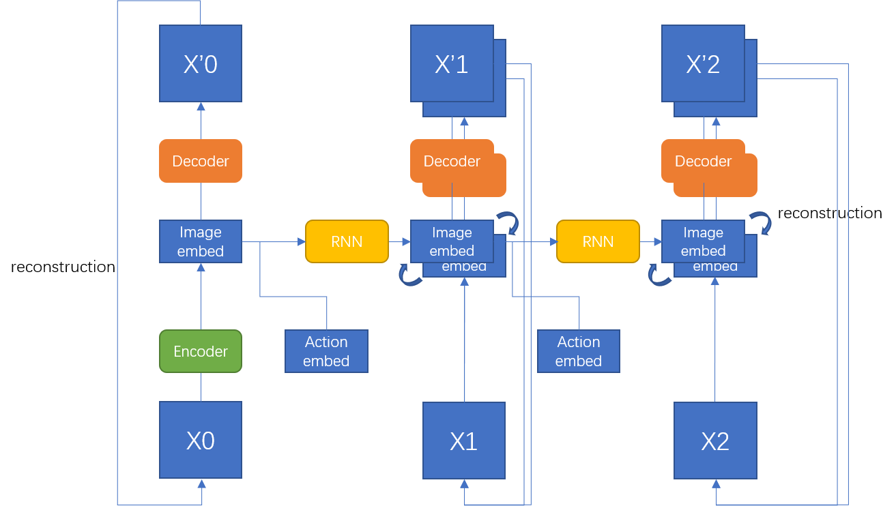

# Unsupervised Generative Disentangled Action Embedding Extraction

**Unsupervised**: without action supervision

**Generative**: We use a generrative model

**Disentangled**: We wish to extract the action embedding only, which is object-agnostic.

## Model


## Slides
[Proposal](https://docs.google.com/presentation/d/1tsfbN8aLZl1RS3epBdQ2Jkkthdxr8mmmnycfGUP0ld8/edit?usp=sharing)

## Training and testing

Our framework can be used in several modes. In the motion transfer mode, a static image will be animated using a driving video. In the image-to-video translation mode, given a static image, the framework will predict future frames.

### Installation

We support ```python3```. To install the dependencies run:
```
pip3 install -r requirements.txt
```

### YAML configs

There are several configuration (```config/dataset_name.yaml```) files one for each `dataset`. See ```config/actions.yaml``` to get description of each parameter.

<!-- ### Motion Transfer Demo 

To run a demo, download a [checkpoint](https://yadi.sk/d/BX-hwuPEVm6iNw) and run the following command:
```
python demo.py --config  config/moving-gif.yaml --driving_video sup-mat/driving.png --source_image sup-mat/source.png --checkpoint path/to/checkpoint
```
The result will be stored in ```demo.gif```. -->

### Training

Training the model : 

Without using half-half split between reconstructed and train:
```
python3 run_update1.py --config config/actions.yaml --mode train --verbose
```

Using the half-half split 
```
python3 run_update2.py --config config/actions.yaml --mode train --verbose
```
Inference: 

```
python3 run_update2.py --config config/actions.yaml --mode infer --verbose --checkpoint <path_to_checkpoint>
```

KNN Analysis: 
```
python3 knn_analysis.py --config config/actions.yaml --log_dir <path_to_log_directory>
```

The code will create a folder in the log directory (each run will create a time-stamped new directory).
Checkpoints will be saved to this folder.
To check the loss values during training in see ```log.txt```.
You can also check training data reconstructions in the ```train-vis``` subfolder.


## Reference
[1][Animating Arbitrary Objects via Deep Motion Transfer](https://arxiv.org/abs/1812.08861) by Aliaksandr Siarohin, Stéphane Lathuilière, [Sergey Tulyakov](http://stulyakov.com), [Elisa Ricci](http://elisaricci.eu/) and [Nicu Sebe](http://disi.unitn.it/~sebe/).
